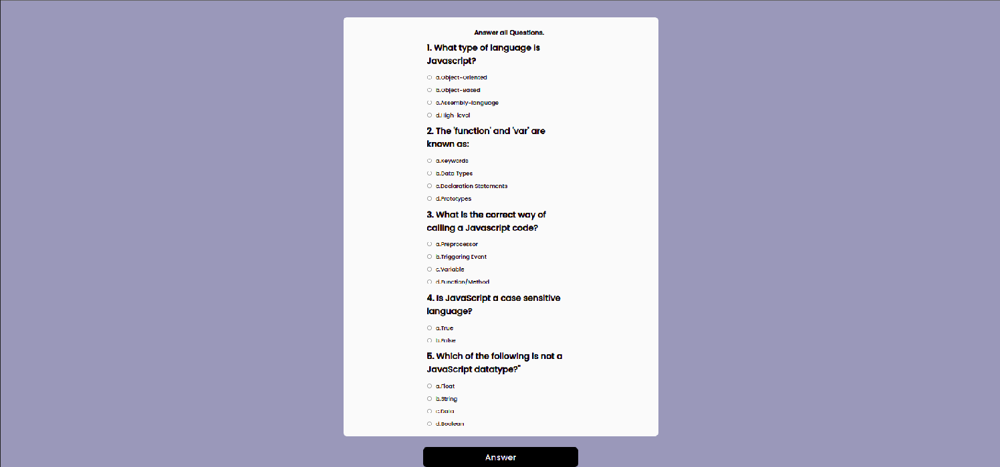

# QuizBoard
An interactive question board for users to view questions and submit answers to test knowledge on JavaScript.
##### By Florence Wambui.

## Table of Content

+ [Description](#description)
+ [Interface Design](#Interface-design)
+ [Technology Used](#technology-used)
+ [Reference](#reference)
+ [Authors Info](#author-Info)

## Description

This is  a website that  allows userd to test their know-how in JavaScript by taking curated questions and having their scores displayed upon submitting the chosen answers.

### Interface Design
The interface is designed using figma wireframes as attached: [Figma](https://www.figma.com/file/YXZkPUEYXa3no1n9VYNUK1/QuizBoard-Site?node-id=0%3A1).

### Apperance.
**Homepage**

**Questions Page**

**Live Page**
 >This is the link to the live page: https://flowambui.github.io/QuizBoard/

### Requirements

* Access to a desktop or laptop.
* An access to the Internet.

## Technology Used
* HTML - which was used to build the structure of the pages.

* CSS - which was used to style the web pages.

* JavaScript - which was used to make the webpage dynamic.

## Reference
* Tutorials Point
* W3 Schools
* You-Tube Tutorials

## Authors Info

Email Address- [Florence Wambui](gflorencewambui@gmail.com)

